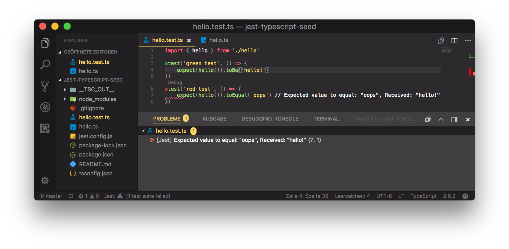

# jest-typescript-seed
> If you want to write jest unit tests in typescript without using any of the popular webframeworks like angular or react, then use this project as a seed.

clone this project
```bash
git clone git@gitlab.com:frfis/jest-typescript-seed.git
```
and install the dependencies
```bash
npm install
```

Or follow the steps below to create your own project:

# modules you should install

```bash
npm install jest ts-jest typescript jest-preset-typescript --save-dev
```
as described here: https://github.com/DSchau/jest-preset-typescript

add the preset to jest config:
```json
"preset": "jest-preset-typescript"
```

install the jest type definitions
```bash
npm install --save-dev @types/jest
```
otherwise vscode marks jest functions like `test` and `expect` as errors

#  miscellaneous tips

## generate a tsconfig.json with tsc
```bash
tsc --init
```
now its easier to see, which tsc config settings are available.

## if you use vscode try vscode-jest extension
https://github.com/jest-community/vscode-jest


You can install vscode extensions without an online connection.
Visit the extension page on the marketplace, e.g. https://marketplace.visualstudio.com/items?itemName=Orta.vscode-jest. There is a link `Download Extension` on the right side under `Resources`. This downloads a vsix-file.
Install it on the command line, e.g.
```bash
$ code --install-extension ~/Downloads/Orta.vscode-jest-2.5.8.vsix
Extension 'Orta.vscode-jest-2.5.8.vsix' was successfully installed!
```
## use a separate jest.config.js
do not put all your jest config into package.json

## configure outdir in tsconfig.json

```json
{
  "compilerOptions": {
    "target": "es5",
    "module": "commonjs",
    "outDir": "./__TSC_OUT__", // <-- or some other name you like
    "strict": true

}
```
and add it to ignorepath in jest.config.js
```js
module.exports = {
    preset: "jest-preset-typescript",
    testPathIgnorePatterns: [
        'node_modules',
        '__TSC_OUT__',
    ],
}
```
dont forget to add node_modules to to ignore path.
And add the outdir to `.gitignore`
(Of course alternatively you could also prevent, that jest matches js-files as tests.)

Is this really necessary? No.

If you call tsc directly and you did not configure outdir, the generated
js-files might be written to folders where jest looks for test-suite-files.
And if you did not change the jest default for matching test file names,
jest might find the same suite-file twice, e.g. hello.test.ts and hello.test.js.


https://www.learnrxjs.io

http://rxmarbles.com